# DT_API
#### UseCase-1: Air_Quality

The air quality data such as co2, humidity, and tempertaure is obtained with the scd-30 sensor for analysing the airquality and creating awareness with led notifications in case of higher co2 values in rooms.

#### UseCase-2: Energy_Consumption

The energy consumption of microcontrollers are measured in terms of current, power, and voltage with the INA_219 current sensor for minimising the energy consumption as much as possible.

#### DT_API

The digital twin represents the api that is created for performing the CRUD operations for the airquality  and energy consumption use-case.

The api is created using the fast api framework in Python. The digital twin api for both the use cases are set up with the [docker-compose.yaml file]('https://github.com/Ramya-Jayaraman-CseJku/DT_API/blob/main/docker-compose.yaml'). 

#### Docker Installation

##### Pre-requisites:

In order to run the docker compose, the docker needs to be installed in the system.

##### Windows:

Install docker desktop on windows by following the´instructions provided in the [link]('https://docs.docker.com/desktop/install/windows-install/').

#### Deployment

After successful installation of the docker in your system, clone the repository and navigate to the project folder for running the docker-compose file with command.

`docker-compose up`

If the build is successful, you can see the services running on the ports as shown in table below. Navigate to the browser and check if the ports are running in localhost, for example the fastapi provides the graphical interface by default for performing the CRUD operations and can be viewed with the 'docs' path. The sample url for the air quality use case will be

 'http://localhost:8000/docs'.

| services                      | port |
| ----------------------------- | ---- |
| fast_api (air quality)        | 8000 |
| fast_api (energy consumption) | 8080 |
| grafana                       | 3000 |
| pgAdmin                       | 5050 |

#### Verifying the services:

##### PgAdmin- Set up the credentials:

Navigate to the browser url "http://localhost:5050", the pgAdmin interface will be visible and you can login into the pgAdmin with the following email id (pgadmin4@pgadmin.org) and password(admin).

After successful login, add the new server by clicking on the add new server button.

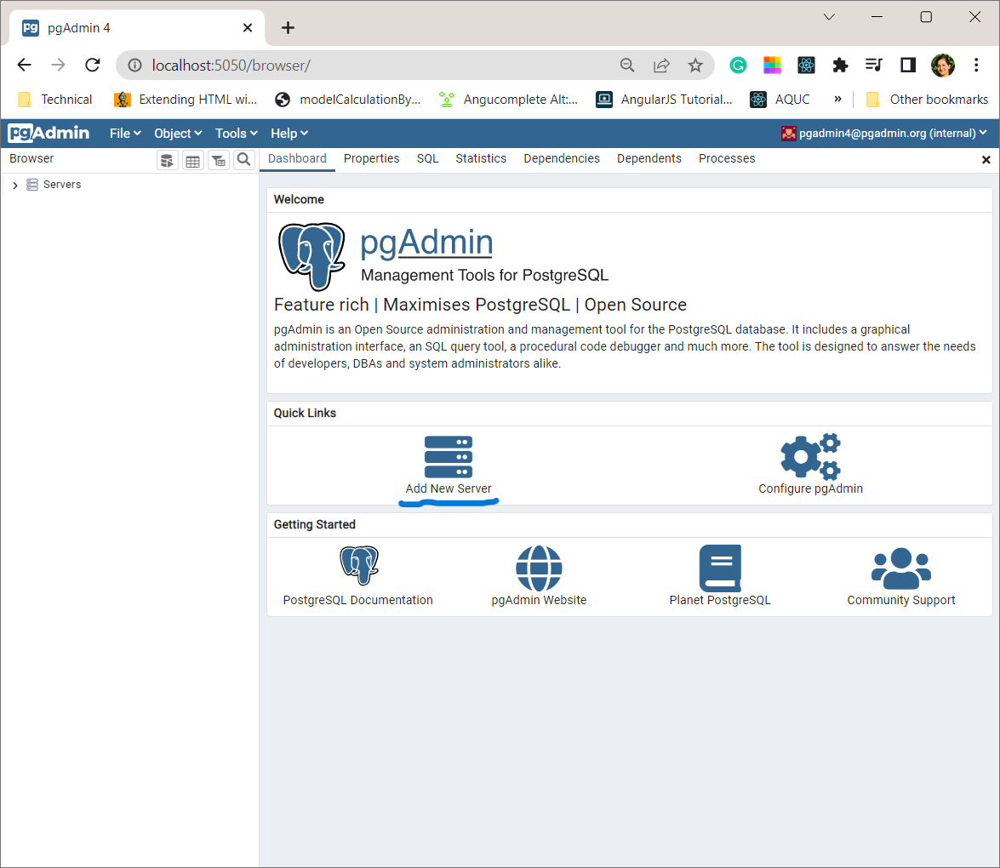

Add a default host name and the database credentials based on the docker-compose.yaml configuration for the timeScaleDatabase container.

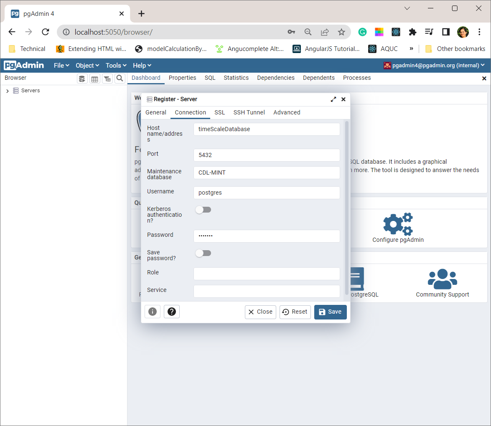

Now the tables will be created automatically based on the [database schema](https://github.com/Ramya-Jayaraman-CseJku/DT_API/Database_Schema.sql) file.

##### fast API:

Now we can use the fast API requests to perform CRUD operations on the created tables.

Navigate to the browser and check if the API is up and running from the following ports (8000 and 8080) from localhost server.

The screenshots of the API are as follows :

fast API for the air quality use case:

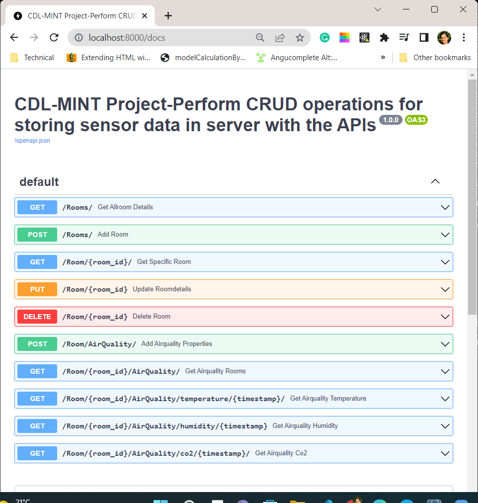

fast API for the energy consumption use case:

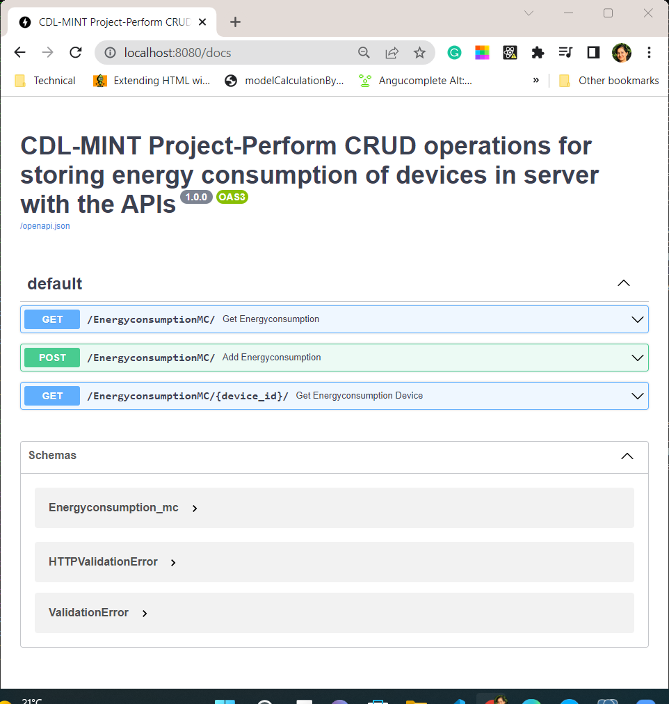

#### Sample POST Requests:

##### Room creation:

The air quality properties are analysed with respect to room, so the room need to be created first as the room id is the foreign key in the air quality properties table.

The room is created with the sample entry as shown in figure.

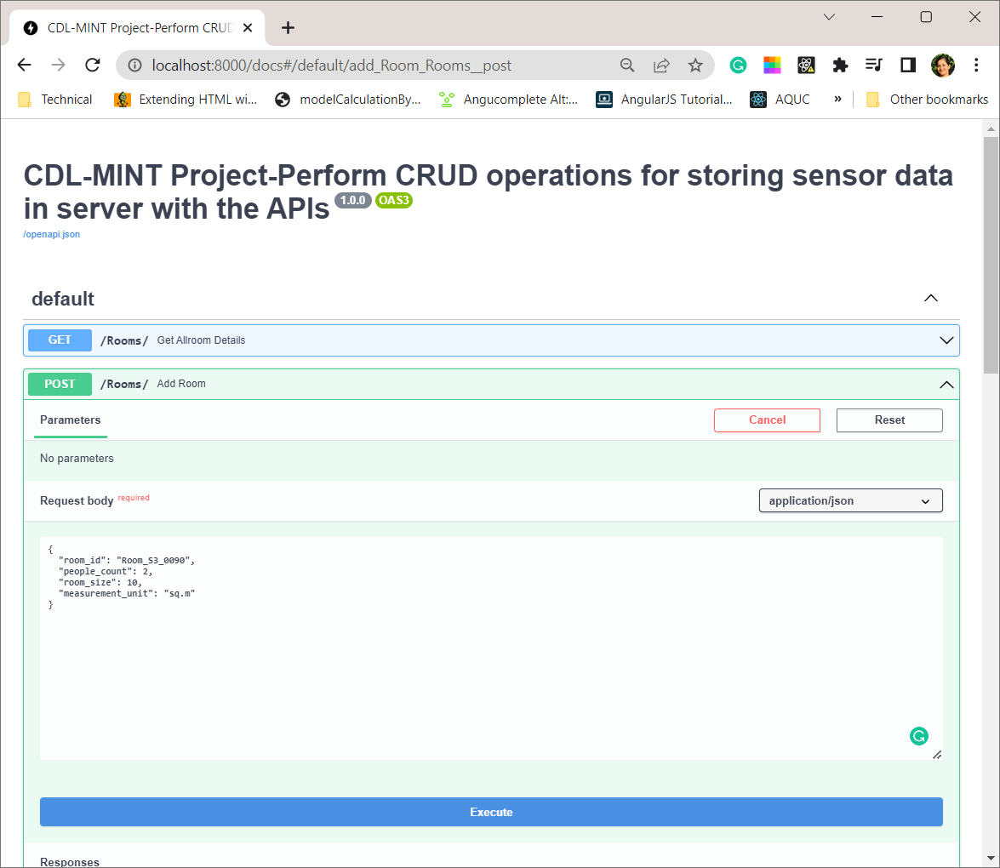

After entering the sample data, press the execute button, after the POST request is successful, you can see the success response with status 201, row is created in the room table in the timescale database.

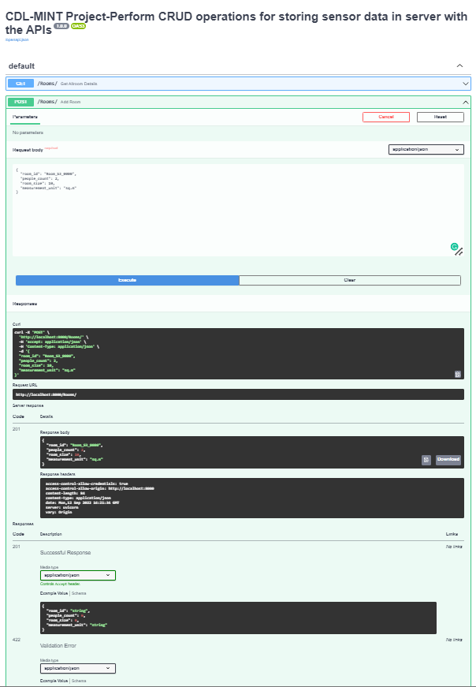

Verify if the data entry is present in the room table as shown in figure.

##### Air quality properties:

The sample air quality measurements for the room is shown in figure.

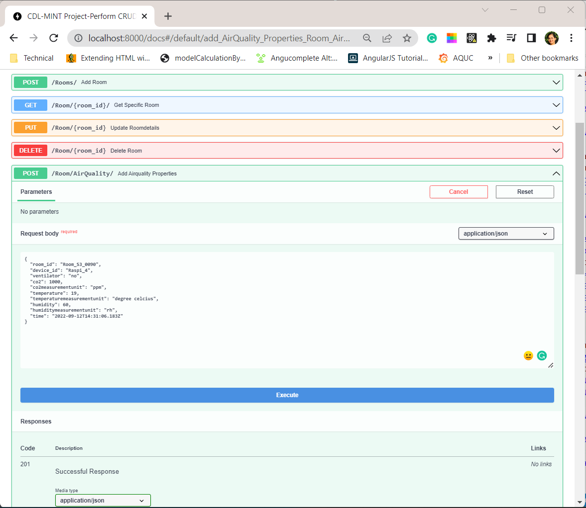 

##### Grafana: 

**Login**:

Navigate to the browser url "http://localhost:3000", the grafana interface will be visible and you can login with the default username and password as admin. Then change the passwod accordingly.

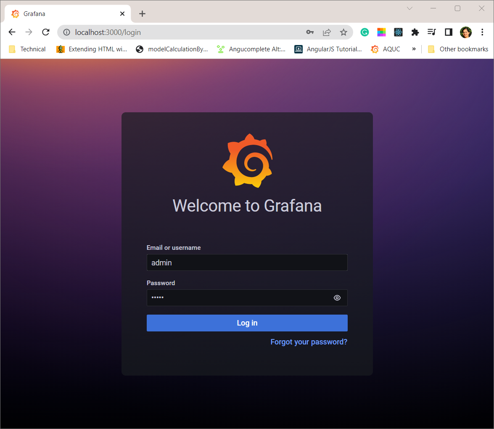

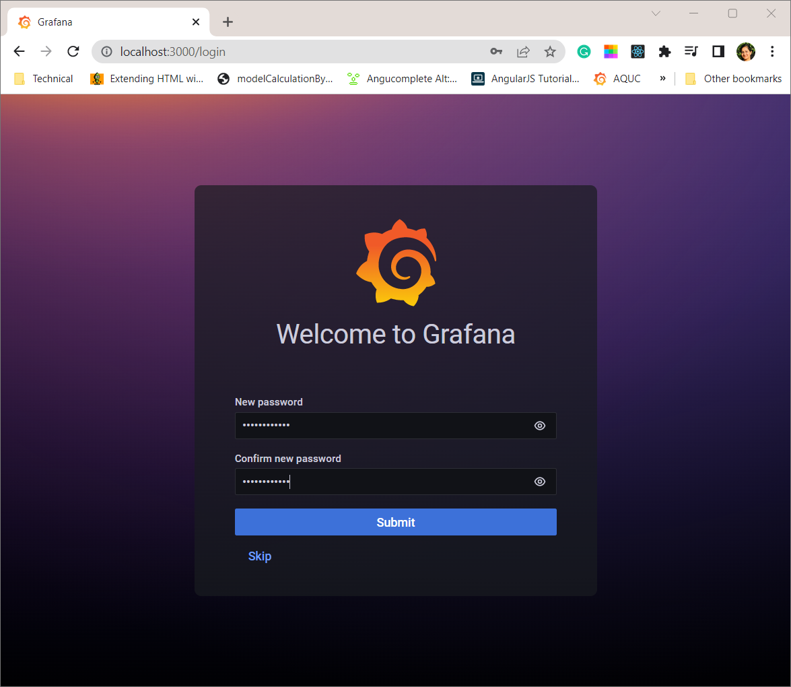

**Grafana- Data Sources:**

Integrate the postgresql database as the datasource for visualisation in grafana. You can create the new dashboard panel and also the add the data source for the panel as shown below.

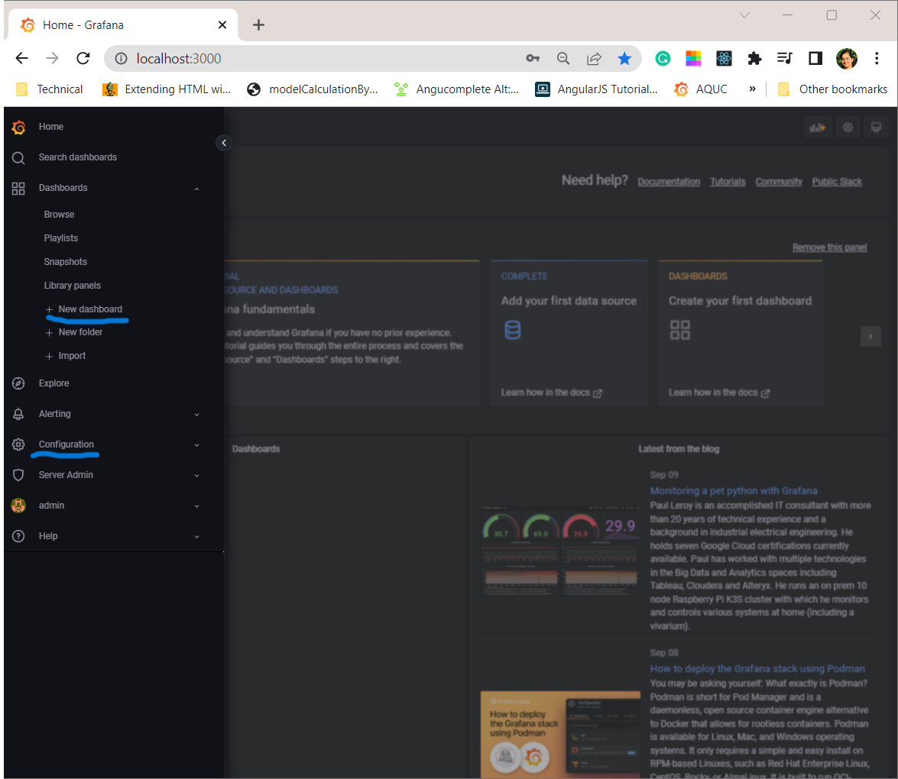

Click on the configuration button and then the add data source button as shown in figure.

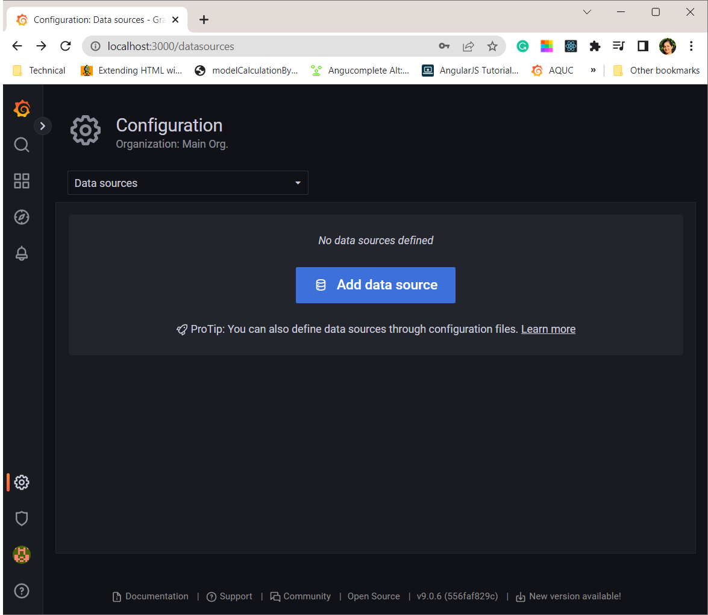

Search for the postgresql data source and select from the filtered options, there are also other data sources that can be used.

Add the data source credentials (database, username, and password) based on the docker-compose.yaml configuration, make sure that the host name matches the docker container name of the timescale data source. The host name is essential for the grafana to identify the data source in the server.  Disbale the verification certification (TLS/SSL Mode). Test if the the database connection is successful as shown in  figure.

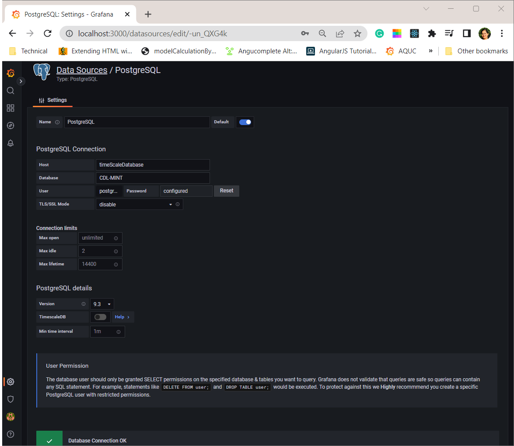

Add new panel from the menu and edit the properties for the panel.

The air quality measurements and the energy consumption data can be visualised as shown in figure.

